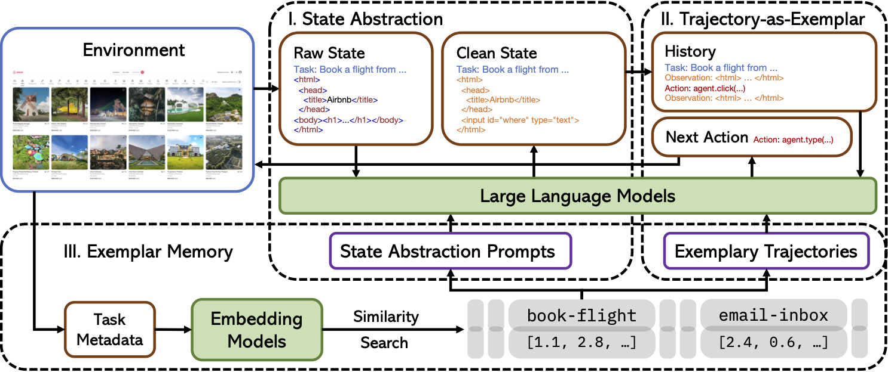
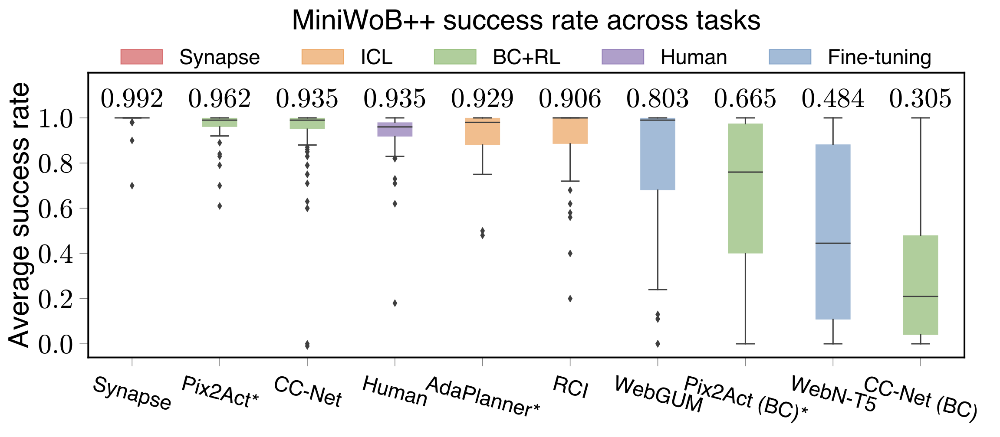

[](https://www.python.org/downloads/release/python-31012/)
<a href="https://github.com/psf/black"></a>

# Synapse: Trajectory-as-Exemplar Prompting with Memory for Computer Control

## News

[9/30/2023] We've updated the code format, added evaluation with Mind2Web, and transferred the results to Google Drive. Please kindly re-clone the repository. Our paper on arXiv will be updated soon. Stay tuned!

[6/13/2023] We preprinted our v1-paper on arXiv.

## Overview

We introduce Synapse, an agent that incorporates trajectory-as-exemplar prompting with the associated memory for solving computer control tasks.




Synapse outperforms the state-of-the-art methods on both MiniWoB++ and Mind2Web benchmarks.




## Install

```bash
conda create -n synapse python=3.10 -y
conda activate synapse
pip install -r requirements.txt
```

Install [Faiss](https://github.com/facebookresearch/faiss/blob/main/INSTALL.md) and Download [Mind2Web](https://github.com/OSU-NLP-Group/Mind2Web) dataset and element rankings.

## Run
Use `build_memory.py` to setup the exemplar memory.

The `memory` folder should contain the following two files:
`index.faiss` and `index.pkl`.

Run MiniWoB++ experiments:
```bash
python run_miniwob.py --env_name <subdomain> --seed 0 --num_episodes 50
python run_miniwob.py --env_name <subdomain> --no_memory --no_filter --seed 0 --num_episodes 50
```

Run Mind2Web experiments:
```bash
python run_mind2web.py --data_dir <path_to_mind2web_dataset> --benchmark <test_task/test_website/test_domain>
python run_mind2web.py --benchmark <test_task/test_website/test_domain> --no_memory --no_trajectory
```

## Results

<div style="display: flex; justify-content: space-between;">
    
    
    
</div>

The trajectories of all experiments can be downloaded from [here](https://drive.google.com/file/d/1hiPQj7m06xU9FEhQTqIJfIlajbov5aWj/view?usp=sharing).

## Citation

```bibtex
@article{zheng2023synapse,
  title={Synapse: Leveraging Few-Shot Exemplars for Human-Level Computer Control},
  author={Zheng, Longtao and Wang, Rundong and An, Bo},
  journal={arXiv preprint arXiv:2306.07863},
  year={2023}
}
```
